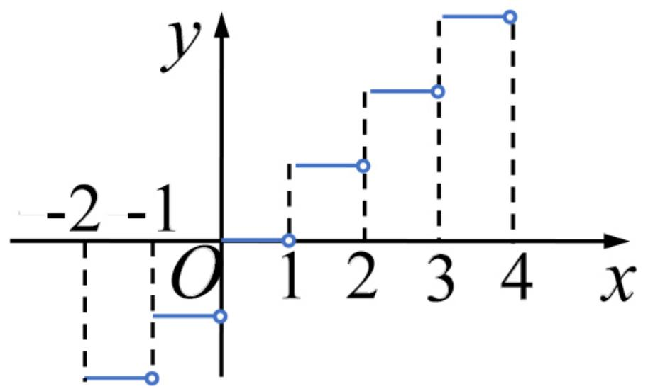
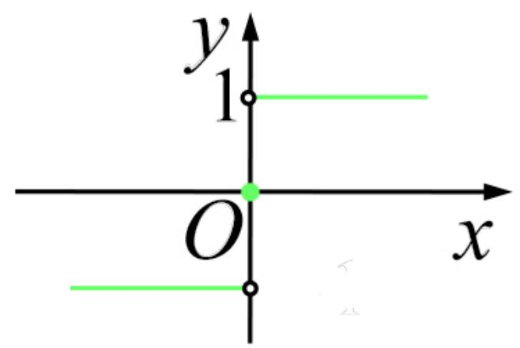

# 1. 函数概念

定义 如果对于每个数 $\boldsymbol { x } \in D$ ,变量 $y$ 按照一定的法则总有一个确定的 $y$ 和它对应, 则称 $x$ y是 的函数, 记为$y = f ( x )$ .常称 $x$ 为自变量， $y$ 为因变量, $D$ 为定义域.

定义域 $D _ { f } = D .$

值域

【注】函数概念有两个基本要素：定义域、对应法则.

【例1】 函数

$$
y = | x | = \left\{ \begin{array}{l l} - x, & x <   0, \\ x, & x \geq 0 \end{array} \right.
$$

称为绝对值函数.

【例2】 函数

$$
y = \operatorname {s g n} x = \left\{ \begin{array}{l l} - 1, & x <   0, \\ 0, & x = 0, \\ 1, & x > 0 \end{array} \right.
$$

称为符号函数.

【例3】设 $x$ 为任意实数，不超过 $x$ 的最大整数称为 $x$

的整数部分，记为 $[ x ]$ .函数 $y = [ x ]$ 称为取整函数.