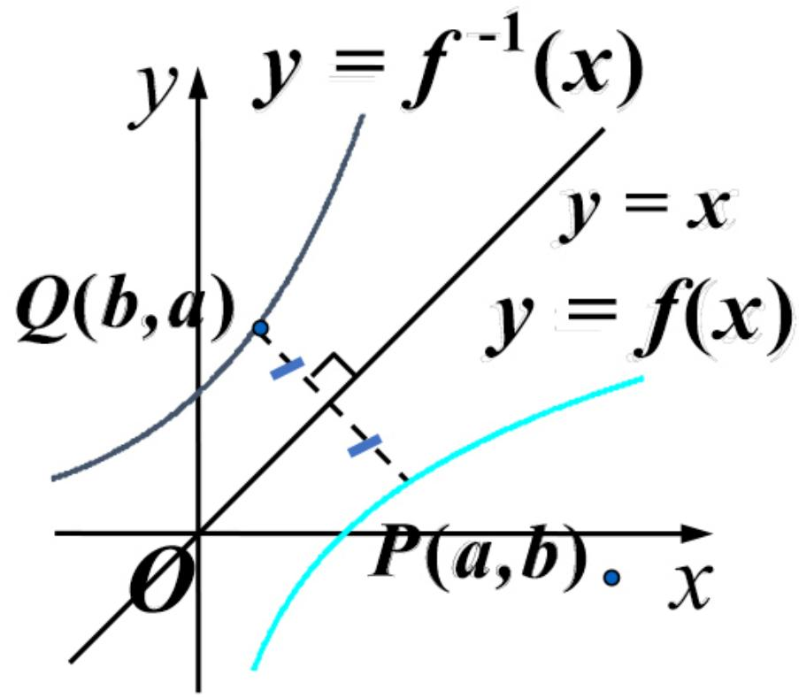

# 反函数

定义设函数 $y = f ( x )$ 的定义域为 $\pmb { D }$ ，值域为 $R _ { \mathrm { , } }$ .若对任意$\boldsymbol { y } \in R _ { y }$ ，有唯一确定的 $\boldsymbol { x } \in D$ ，使得 $y = f ( x )$ ，则记为 $x = f ^ { - 1 } ( y )$ 称其为函数 $y = f ( x )$ 的反函数.

【注】函数 $y = f ( x )$ 与其反函数$\boldsymbol { y } = \boldsymbol { f } ^ { - 1 } ( \boldsymbol { x } )$ 的图形关于直线$y = x$ 对称。

